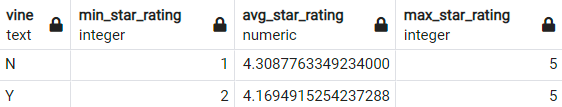
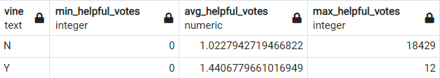
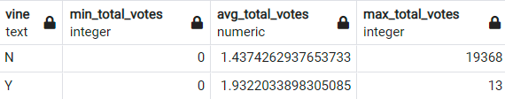
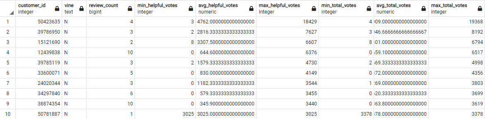
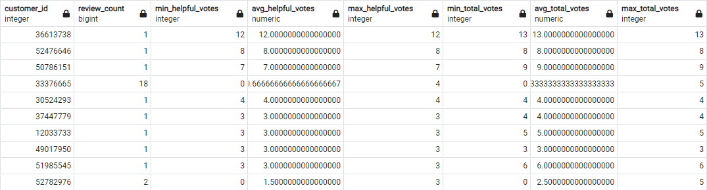
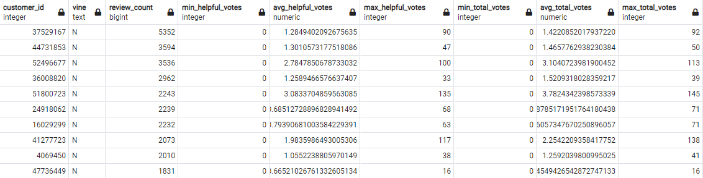
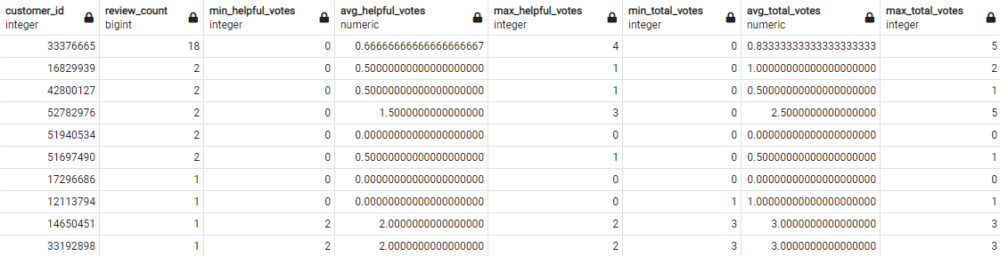
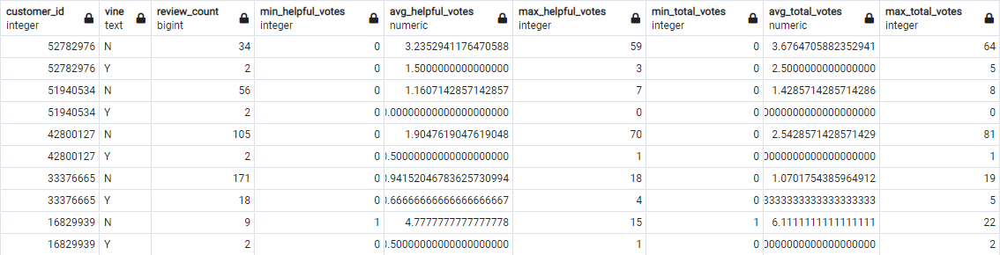

# big_data_amazon_reviews
UofA Data Analytics Bootcamp Homework Assignment 22-Big-Data

### Project Description
Amazon provides their product review data sets to the public for perusal and analysis.  This project utilizes Google Colab cloud computing to perform an Extract, Transfer and Load (ETL) process to an Amazon RDS postgreSQL server. PySpark is used to complete the ETL process. Then postgreSQL is used to analyze the reviews for trustworthiness.

### Tools Utilized
Google Colab, PySpark, Amazon RDS, postgreSQL

### Project Content Descriptions
* assignment_instructions: Instructions and starter code for completing the assignment.
* images: Screen captures of database queries.
* level-1: ETL notebook
* level-2: SQL analysis script
* LICENSE: MIT License Disclosure

### Database Contents
The database holds four data tables of Amazon ebook reviews.  Those tables are:
* review_id_table
    * review_id
    * customer_id
    * product_id
    * product_parent
    * review_date
    
* products
    * product_id
    * product_title
    
* customers
    * customer_id
    * customer_count
    
* vine_table
    * review_id
    * star_rating
    * helpful_votes
    * total_votes
    * vine

### Trustworthiness Analysis of Amazon Reviews
The definition of a Vine customer is: "Amazon Vine invites the most trusted reviewers on Amazon to post opinions about new and pre-release items to help their fellow customers make informed purchase decisions. Amazon invites customers to become Vine Voices based on their reviewer rank, which is a reflection of the quality and helpfulness of their reviews as judged by other Amazon customers. Amazon provides Vine members with free products that have been submitted to the program by participating vendors. Vine reviews are the independent opinions of the Vine Voices. The vendor cannot influence, modify or edit the reviews. Amazon does not modify or edit Vine reviews, as long as they comply with our posting guidelines. A Vine review is identified with the green stripe Customer review from the Amazon Vine Program." [<a href="https://www.amazon.com/gp/vine/help?ie=UTF8" target="_blank">What is Amazon Vine</a>]

The following investigation drills down through the data to determine if Vine reviews are trustworthy.

* Minimum, average and maxiumum Star Rating. There are not significant differences between vine/not vine customers.
  
    

* Minimum, average and maxiumum Helpful Votes count. There is a very large difference in vine/not vine customers for max_helpful_votes that is worth investigating further.
    
    

* Minimum, average and maxiumum Total Votes count.  There is a very large difference in vine/not vine customers for max_total_votes that is worth investigating further.

    

* Statistics for customers with the most max_helpful_votes.  Vine customers do not show up in the top 10 max_helpful_votes reviews. 
  
    

* Statistics for Vine customers with the most max_helpful_votes.  The Vine customers most max_helpful_votes reviews don't have very many reviews. I would have expected vine customers to have 10-20 reviews each.  Meaning they have reviewed multiple items, but not so many items that they look like a bot.
  
    

* Statistics for customers with the most reviews.  Vine customers do not show up in the top 10.  The reviewers with the most reviews have counts that are unreasonably high. I don't see how a customer could read thousands of ebooks in a year.
  
    

* Statistics for Vine customers with the most reviews.  Amazon Vine customers produce very few reviews in the ebooks category with the exception of 1 customer.  

    

* Statistics for the Vine customers with the most reviews to see if they also have non-Vine reviews.  All of these customers have a reasonable number of non-Vine ebook reviews that have at least a handful of review votes.  These statistics appear to show that Vine reviews are trustworthy. 

    


### Replication Instructions
1. Create Amazon RDS PostgreSQL database.  
    * Make note of the DB identifier, Endpoint and password.
    * Ensure that inbound security rules allow postgreSQL access from all IP addresses.
2. Copy level-1/amazon_ebook_reviews.ipynb into Google Colab
3. Run amazon_ebook_reviews.ipynb
    * When asked, provide RDS URL in this format
    ```python
    jdbc:postgresql://<Endpoint>:5432/<DB identifier>
    ```
    * When asked, provide password for the database
4. Access the database in pgAdmin 4 or dBeaver.
5. Run level-2/query.sql 

### Source Data and Starter Code
* Starter code and data provided by UofA Data Analytics Bootcamp
* <a href="https://s3.amazonaws.com/amazon-reviews-pds/tsv/index.txt" target="_blank">Amazon Reviews Databases</a>
    * <a href="https://s3.amazonaws.com/amazon-reviews-pds/tsv/amazon_reviews_us_Digital_Ebook_Purchase_v1_00.tsv.gz" target="_blank">https://s3.amazonaws.com/amazon-reviews-pds/tsv/amazon_reviews_us_Digital_Ebook_Purchase_v1_00.tsv.gz</a>
    * <a href="https://s3.amazonaws.com/amazon-reviews-pds/tsv/amazon_reviews_us_Digital_Ebook_Purchase_v1_01.tsv.gz" target="_blank">https://s3.amazonaws.com/amazon-reviews-pds/tsv/amazon_reviews_us_Digital_Ebook_Purchase_v1_01.tsv.gz</a>